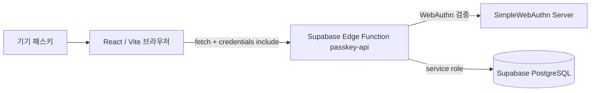

# PassKey 포트폴리오

React/Vite로 만든 개인 포트폴리오에 패스키(WebAuthn) 기반 비공개 영역을 결합한 프로젝트입니다. 공개 영역에서는 학습 과정과 경험을 소개하고, 페이지 하단의 PRIVATE / 04에서는 서버 검증을 통과한 사용자만 가상 개인 작업 기록을 확인할 수 있습니다.

## 상태 및 데모

- 공개 배포 주소: 저장소와 현재 작업 환경에서 확인되지 않음
- 스크린샷: 저장소의 `docs/images` 디렉터리에 실제 이미지가 없어 포함하지 않음
- 원격 Supabase, 모바일 패스키, 배포 결과: 이 환경에서 확인하지 않음
- 로컬 lint/build: 통과

확인하지 못한 배포·모바일·원격 API 결과는 README에서 완료된 것으로 표시하지 않습니다.

## 프로젝트 소개

이 프로젝트는 채용 담당자에게 학습 과정, 협업 경험, 직접 문제를 해결한 사례를 보여주는 포트폴리오입니다. 공개 콘텐츠와 개인 작업 기록을 한 페이지에 함께 두되, 개인 기록의 본문은 클라이언트 번들에 넣지 않고 인증 이후 Edge Function이 전달하도록 구성했습니다.

패스키 등록·인증에는 비밀번호 대신 WebAuthn을 사용합니다. 서버는 기기가 보관하는 개인키를 받지 않고 공개키만 저장하며, 인증 성공 후에만 세션 쿠키를 발급합니다.

## 주요 기능

| 기능 | 설명 | 구현 근거 및 확인 방법 |
| --- | --- | --- |
| ABOUT | 이름, 소개, 네트워크관리사 2급 필기 합격 근거를 표시합니다. | `src/components/Hero.jsx`, `src/data/portfolio.js` |
| WHAT I DID | 학습·협업·PC 구성 경험을 카드로 표시하고 상황·행동·결과를 펼쳐봅니다. | `src/components/WhatIDid.jsx` |
| WHAT I LIKE | 컴퓨터와 게임에 대한 관심사 및 키워드를 표시합니다. | `src/components/WhatILike.jsx` |
| 첫 패스키 등록 | 테스트 계정 이름과 패스키 이름을 입력하고 기기에서 첫 패스키를 등록합니다. | `PrivateArea.jsx`의 `startEnroll`, `register-options`, `register-verify` |
| 패스키 로그인 | 새 challenge를 받은 뒤 기기의 패스키 서명을 서버 공개키로 검증합니다. | `PrivateArea.jsx`의 `signIn`, Edge Function의 `authVerify` |
| 비공개 자료 조회 | 인증된 사용자에게만 서버 생성 가상 자료 3개와 패스키 목록을 표시합니다. | `private-items`, `me` |
| 추가 패스키 관리 | 로그인한 계정에 패스키를 추가하고 이름·등록 날짜를 확인하거나 삭제합니다. | `startEnroll`, `passkeys`, `passkey-delete` |
| 세션 종료 | 로그아웃 시 현재 세션을 폐기하고 세션 쿠키를 만료시킵니다. | `logout`, `currentUser` |

## 기술 스택

| 구분 | 기술 | 사용 목적 |
| --- | --- | --- |
| Frontend | React 18 | 화면과 상태 관리 |
| Build | Vite 5 | 개발 서버와 운영 번들 생성 |
| Styling | Tailwind CSS 3 | 포트폴리오 레이아웃과 반응형 스타일 |
| Icons | Lucide React | 화면 아이콘 |
| Browser WebAuthn | `@simplewebauthn/browser` 14.0.0 | 브라우저 패스키 등록·인증 호출 |
| Backend | Supabase Edge Function(Deno) | WebAuthn 검증, 세션, 비공개 자료 API |
| Server WebAuthn | `@simplewebauthn/server` 14.0.0 | registration/authentication response 검증 |
| Database | Supabase PostgreSQL | 사용자·세션·challenge·패스키·비공개 자료 저장 |

실제 배포 서비스와 URL은 저장소에서 확인되지 않으므로 Deployment 항목은 기재하지 않았습니다.

## 시스템 구조



브라우저의 `src/lib/api.js`는 Supabase URL에 `/functions/v1/passkey-api?action=...`를 붙여 Edge Function을 호출합니다. 브라우저는 데이터베이스를 직접 조회하지 않습니다.

## 주요 사용자 흐름

### 첫 패스키 등록

1. `PRIVATE / 04`에서 `첫 패스키 등록`을 선택합니다.
2. 테스트 계정 이름과 패스키 이름을 입력합니다.
3. `enroll-start`가 5분 유효 HMAC 서명 enrollment token을 발급합니다.
4. `register-options`가 registration challenge와 registration token을 발급합니다.
5. 브라우저가 기기의 패스키 생성 UI를 엽니다.
6. `register-verify`가 attestation을 검증합니다. 신규 계정이면 그때 사용자·가상 자료·공개키·세션을 저장하고, 이미 로그인한 계정이면 공개키를 추가합니다.

등록이 취소되거나 브라우저에서 `NotAllowedError`가 발생하면 프런트 상태를 초기화하고, 가능한 경우 `enroll-cancel`로 사용하지 않은 challenge를 정리합니다. 탭을 닫아 취소 요청 자체가 전송되지 않는 경우를 위한 별도 purge 작업은 없습니다.

### 패스키 로그인과 비공개 조회

1. `패스키로 들어가기`를 선택합니다.
2. `auth-options`가 새 authentication challenge와 `authChallengeToken`을 발급합니다.
3. 브라우저가 기기의 패스키 서명을 요청합니다.
4. `auth-verify`가 challenge를 먼저 1회 소비하고 저장된 공개키로 서명을 검증합니다.
5. 성공하면 서버가 HMAC 서명 세션 쿠키를 발급합니다.
6. 프런트엔드가 `me`와 `private-items`를 순서대로 요청해 비공개 화면을 표시합니다.

### 패스키 삭제

로그인 후 패스키 목록에서 삭제를 선택하면 `DELETE` 요청으로 현재 세션 사용자 소유의 credential만 삭제합니다. 마지막 패스키를 삭제하면 사용자의 활성 세션을 폐기하고 쿠키를 만료시킵니다.

## API 명세

모든 요청은 Supabase Edge Function 기본 경로에 `action` query를 사용합니다.

`/functions/v1/passkey-api?action=<action>`

| Action | Method | 인증·입력 | 동작 및 주요 오류 |
| --- | --- | --- | --- |
| `enroll-start` | `POST` | JSON `username`; 세션 불필요 | 새 테스트 계정용 enrollment token 발급. 이름이 없으면 `400 invalid_username` |
| `enroll-cancel` | `POST` | 선택적 `X-Enrollment-Token`, `X-Registration-Token` | 사용하지 않은 등록 challenge 삭제 |
| `register-options` | `POST` | 로그인 세션 또는 enrollment token | WebAuthn 등록 옵션과 registration token 발급. 컨텍스트가 없으면 `401` |
| `register-verify` | `POST` | `X-Registration-Token`; 신규 계정은 enrollment token도 필요 | attestation 검증 후 공개키와 계정 정보 저장. 검증 실패 시 `400 registration_verification_failed` |
| `auth-options` | `POST` | 세션 불필요 | 새 authentication challenge와 인증 token 발급 |
| `auth-verify` | `POST` | `X-Auth-Challenge-Token`, credential JSON | 공개키로 서명 검증 후 세션 쿠키 발급. challenge 오류·알 수 없는 패스키는 `401` |
| `me` | `GET` | 세션 쿠키 필요 | 인증 사용자와 등록 패스키 목록 반환. 미인증은 `401` |
| `private-items` | `GET` | 세션 쿠키 필요 | 세션 사용자에게 속한 비공개 자료 반환. 미인증은 `401 authentication_required` |
| `private-for-user` | `GET` | 세션 쿠키와 `user_id` 필요 | 세션 사용자와 다른 `user_id`이면 `403 forbidden_user_resource` |
| `passkeys` | `GET` | 세션 쿠키 필요 | 현재 사용자의 패스키 목록 반환 |
| `passkey-delete` | `DELETE` | 세션 쿠키, `credential_id` query | 소유권을 확인한 뒤 패스키 삭제. 대상이 없으면 `404 passkey_not_found` |
| `logout` | `POST` | 현재 세션 선택 | 현재 세션 revoke 및 쿠키 만료 |

클라이언트의 API 호출은 `src/lib/api.js`의 `apiFetch`가 담당하며, session cookie를 위해 `credentials: 'include'`를 사용합니다.

## 데이터베이스 구조

아래는 현재 Edge Function 코드에서 조회·삽입·수정하는 필드입니다. 저장소에는 SQL migration 또는 전체 원격 스키마 파일이 포함되어 있지 않으므로, 실제 원격 컬럼·RLS 정책은 Supabase에서 별도로 확인해야 합니다.

| 테이블 | 코드에서 확인되는 필드 | 역할 |
| --- | --- | --- |
| `portfolio_users` | `id`, `username` | 포트폴리오 사용자와 테스트 계정 |
| `portfolio_sessions` | `id`, `user_id`, `token_hash`, `expires_at`, `revoked_at` | 세션 hash, 만료·폐기 상태 |
| `passkeys` | `id`, `user_id`, `credential_id`, `public_key`, `sign_count`, `transports`, `friendly_name`, `device_type`, `backed_up`, `created_at`, `last_used_at` | WebAuthn 공개 자격 증명 |
| `webauthn_challenges` | `id`, `session_id`, `user_id`, `purpose`, `challenge`, `expires_at`, `used_at`, `created_at` | 등록·인증 challenge의 만료·1회 사용 관리 |
| `private_items` | `id`, `user_id`, `title`, `content`, `created_at` | 사용자별 가상 비공개 자료 |

신규 사용자 생성 시 서버가 계정 marker를 포함한 `프로젝트 메모`, `지원 목록`, `개인 회고` 자료를 생성합니다. 자료 본문은 `src`에 하드코딩하지 않습니다.

## 보안·권한·오류 처리

### 인증과 세션

- 등록 시 `verifyRegistrationResponse`, 로그인 시 `verifyAuthenticationResponse`를 서버에서 호출합니다.
- 서버에는 검증된 공개키만 `passkeys.public_key`로 저장하며 개인키와 비밀번호는 저장하지 않습니다.
- 등록·인증 context token은 `SUPABASE_SERVICE_ROLE_KEY`를 기반으로 HMAC 서명합니다.
- challenge 유효기간은 5분이며, 서버의 `consumeChallenge`가 `used_at`이 비어 있는 최신 challenge만 원자적으로 소비합니다.
- 세션 cookie 이름은 `tb_portfolio_session`이며 `HttpOnly`, `Secure`, `SameSite=None` 속성을 사용합니다.
- 세션 원문은 데이터베이스에 저장하지 않고 SHA-256 hash만 `portfolio_sessions.token_hash`에 저장합니다. 세션 유효기간은 8시간으로 코드에 정의되어 있습니다.

### 사용자 격리

- `privateItems`는 세션에서 확인한 `portfolio_users.id`로 `private_items.user_id`를 제한합니다.
- `privateForUser`는 요청의 `user_id`와 세션 사용자 ID가 다르면 `403 forbidden_user_resource`를 반환합니다.
- 패스키 삭제도 credential ID와 세션 사용자 ID를 함께 조건에 사용합니다.
- 서비스 역할 키는 Edge Function에서만 읽으며 프런트엔드 환경변수로 노출하지 않습니다.

과제 설명서에는 관련 테이블에 RLS를 적용하는 운영 구성이 기록되어 있지만, 이 저장소에는 이를 재현할 migration/policy 파일이 없으므로 원격 적용 여부는 확인이 필요합니다.

### 프런트엔드 오류 안내

`PrivateArea.jsx`는 브라우저 미지원, 사용자 취소, 네트워크 오류, 설정 누락, 만료·재사용 challenge, 검증 실패, 삭제된 패스키, 인증 필요 상태를 사용자 메시지로 변환합니다. 서버의 알 수 없는 예외는 `500 server_error`로 처리합니다.

## 설치 및 실행

### 사전 요구 사항

- Node.js와 npm
- WebAuthn을 지원하는 최신 브라우저
- 패스키를 생성·사용할 수 있는 기기
- `PRIVATE / 04` 기능을 사용하려면 Supabase Edge Function과 원격 데이터베이스 준비

WebAuthn은 보안 컨텍스트가 필요합니다. 로컬 개발은 `localhost`에서 실행하고, 실제 배포는 HTTPS 주소를 사용해야 합니다.

### 의존성 설치

PowerShell 기준:

```powershell
npm install
Copy-Item .env.example .env.local
```

`.env.local`에 프런트엔드 환경변수를 입력한 뒤 개발 서버를 실행합니다.

```powershell
npm run dev
```

Vite가 출력한 주소를 브라우저에서 열면 됩니다. 기본 Edge Function 설정의 로컬 origin은 `http://localhost:5173`입니다.

### 운영 빌드와 미리보기

`package.json`에 정의된 스크립트는 다음과 같습니다.

```powershell
npm run lint
npm run build
npm run preview
```

저장소에는 배포 설정이나 실제 배포 명령 실행 기록이 없으므로 Vercel·Supabase 배포 완료로 간주하지 않습니다.

## 환경 변수

### 프런트엔드

`src/lib/api.js`가 브라우저 번들에서 읽는 변수입니다.

| 변수명 | 필수 여부 | 용도 | 예시 |
| --- | --- | --- | --- |
| `VITE_SUPABASE_URL` | 필요 | Supabase 프로젝트 URL과 Edge Function 기본 URL 구성 | `https://<your-project>.supabase.co` |
| `VITE_SUPABASE_ANON_KEY` | 필요 | Edge Function 호출용 공개 anon key | `<your-public-anon-key>` |
| `VITE_SUPABASE_PUBLISHABLE_KEY` | 선택 | `VITE_SUPABASE_ANON_KEY`가 없을 때 사용할 공개 키 이름 | `<your-publishable-key>` |

`VITE_` 변수는 브라우저에 노출되므로 공개 키만 넣어야 합니다. service role key와 개인 비밀값은 넣지 않습니다.

### Edge Function

`supabase/functions/passkey-api/index.ts`가 Deno 환경에서 읽는 변수입니다.

| 변수명 | 필수 여부 | 용도 | 예시 |
| --- | --- | --- | --- |
| `SUPABASE_URL` | 필요 | 서버 Supabase client 연결 | `https://<your-project>.supabase.co` |
| `SUPABASE_SERVICE_ROLE_KEY` | 필요 | 서버 전용 Supabase 접근 및 HMAC 서명 재료 | `<your-service-role-key>` |
| `WEBAUTHN_RP_ID` | 배포 시 필요 | WebAuthn relying party ID | `<your-domain.example>` |
| `WEBAUTHN_ORIGIN` | 배포 시 필요 | 허용할 WebAuthn origin과 CORS origin | `https://<your-domain.example>` |

코드에는 로컬 기본값으로 `WEBAUTHN_RP_ID=localhost`, `WEBAUTHN_ORIGIN=http://localhost:5173`가 정의되어 있습니다. 실제 배포 주소에서는 반드시 해당 주소에 맞는 값을 사용해야 합니다.

이 저장소에는 Supabase SQL migration이 없으므로, 데이터베이스 테이블과 RLS 정책을 먼저 준비한 뒤 Edge Function을 배포해야 합니다.

## 프로젝트 구조

```text
.
├─ src/
│  ├─ components/
│  │  ├─ Header.jsx          # 상단 네비게이션
│  │  ├─ Hero.jsx            # ABOUT 및 합격 근거
│  │  ├─ WhatIDid.jsx        # 경험 카드와 상세 펼침
│  │  ├─ WhatILike.jsx       # 관심사 카드
│  │  ├─ PrivateArea.jsx     # 패스키 등록·로그인·비공개 영역
│  │  └─ Footer.jsx
│  ├─ data/portfolio.js      # 공개 포트폴리오 콘텐츠
│  ├─ lib/api.js             # Edge Function 호출과 임시 token 관리
│  ├─ App.jsx
│  └─ index.css
├─ supabase/
│  └─ functions/passkey-api/
│     ├─ index.ts            # 인증·세션·비공개 자료 API
│     └─ deno.json
├─ docs-assignment8.md       # 과제 제출 설명 및 미실행 검증 기록
├─ .env.example
├─ package.json
├─ package-lock.json
├─ tailwind.config.js
└─ vite.config.js
```

`vite.config.js`에서 `@` alias가 `src/`를 가리키므로 애플리케이션 코드는 `@/components/...`, `@/lib/...` 형태로 모듈을 가져옵니다.

## 개발 중 해결한 문제

### 비공개 본문이 클라이언트 번들에 들어가지 않도록 분리

- 원인: 브라우저에 개인 기록을 미리 넣으면 인증 전에도 번들에서 본문을 확인할 수 있습니다.
- 해결: `registerVerify`가 신규 사용자별 가상 본문을 서버에서 생성하고, 클라이언트에는 인증 전 제목 목록만 표시합니다.
- 확인: 운영 빌드 후 `dist/assets/*.js`에서 비공개 본문 문자열이 검색되지 않았습니다.

### challenge 재사용 방지

- 원인: 같은 challenge를 여러 번 검증에 사용할 수 있으면 인증 흐름이 약해집니다.
- 해결: `webauthn_challenges.used_at`이 비어 있는 최신 challenge를 검증 직전에 소비하고, HMAC 서명 token과 만료 시간을 함께 확인합니다.
- 확인 범위: 구현과 로컬 build는 확인했지만, 실제 배포 HTTP에서 재전송하는 시나리오는 실행하지 않았습니다.

### 세션 사용자 기준의 자료·패스키 격리

- 원인: 요청 body나 URL의 사용자 ID를 그대로 신뢰하면 다른 사용자의 자료에 접근할 수 있습니다.
- 해결: 비공개 자료와 패스키 삭제 쿼리에 현재 세션 사용자 ID를 사용하고, `private-for-user`의 불일치 요청은 403으로 거절합니다.
- 확인 범위: 코드 경로는 확인했지만, 두 실제 계정으로 수행하는 원격 A/B HTTP 검증은 실행하지 않았습니다.

## 현재 한계와 향후 개선 방향

현재 구현에서 확인되는 미완료 사항은 다음과 같습니다.

- 탭 종료 등으로 취소 API가 호출되지 않은 만료 challenge를 주기적으로 purge하는 작업이 없습니다.
- `SameSite=None` 교차 출처 쿠키를 사용하지만 CSRF 방어를 별도로 구현하지 않았습니다.
- 계정 복구·계정 삭제·관리자 감사 로그·모든 기기 세션 일괄 종료 기능이 없습니다.
- 데이터베이스 migration과 RLS policy 파일이 저장소에 없어 새 Supabase 프로젝트를 코드만으로 재현할 수 없습니다.
- 실제 HTTPS 배포, 모바일 패스키, 두 계정 간 격리, challenge 재사용 차단의 원격 HTTP 증거가 없습니다.
- 비공개 자료는 실제 개인정보가 아닌 과제용 서버 생성 가상 예시 데이터입니다.

향후에는 migration/policy를 버전 관리하고, challenge 정리 작업·CSRF 방어·계정 복구·감사 로그를 추가한 뒤 실제 HTTPS와 모바일 환경에서 전체 시나리오를 검증하는 것이 필요합니다.

## 참고 문서

- [과제 제출 설명서](docs-assignment8.md)
- [프런트엔드 환경변수 예시](.env.example)
