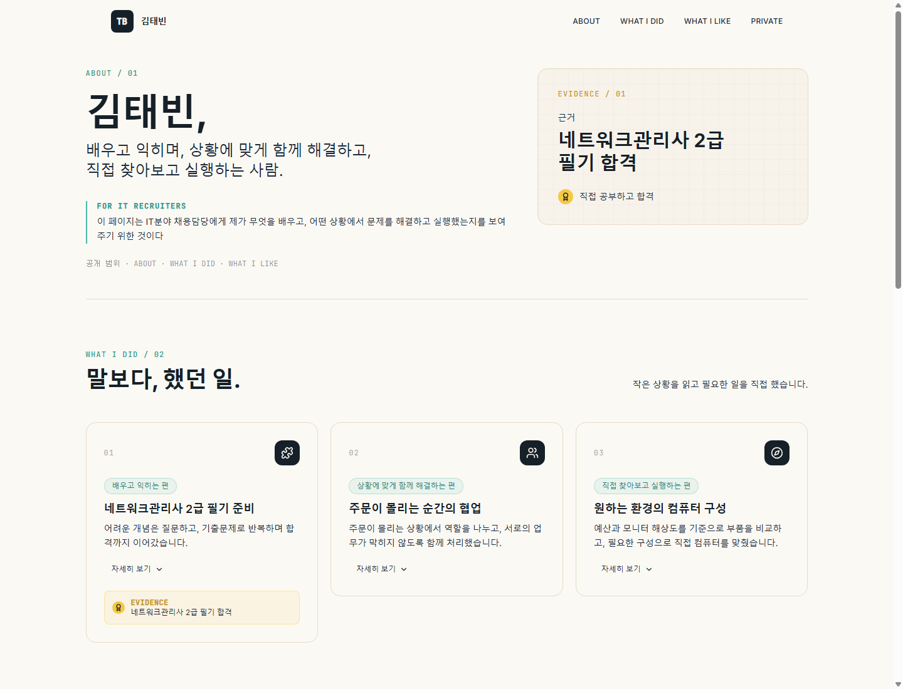

# WebAuthn 패스키 기반 비밀번호 없는 인증

> React와 Vite로 만든 개인 포트폴리오에 패스키(WebAuthn) 기반 비공개 영역을 결합한 프로젝트입니다.

공개 영역에서는 학습 과정과 경험을 소개하고, PRIVATE / 04에서는 인증한 사용자만 서버에서 제공하는 개인 작업 기록을 확인할 수 있습니다.

  

  <a href="https://github.com/Gilin03/webauthn-passkey-auth">GitHub Repository</a>

  
  
  
  
  

## 목차

- [프로젝트 소개](#프로젝트-소개)
- [빠른 시작](#빠른-시작)
- [플레이 흐름](#플레이-흐름)
- [주요 기능](#주요-기능)
- [기술 스택](#기술-스택)
- [시스템 구조](#시스템-구조)
- [프로젝트 구조](#프로젝트-구조)
- [환경 변수](#환경-변수)
- [API 명세](#api-명세)
- [데이터베이스 구조](#데이터베이스-구조)
- [보안 및 권한](#보안-및-권한)
- [테스트 및 검증](#테스트-및-검증)
- [개발 중 해결한 문제](#개발-중-해결한-문제)

## 프로젝트 소개

이 프로젝트는 IT 분야 채용 담당자에게 학습 과정, 협업 경험, 문제를 직접 해결한 사례를 보여주기 위한 포트폴리오입니다.

페이지는 ABOUT, WHAT I DID, WHAT I LIKE, PRIVATE / 04 영역으로 구성됩니다. 공개 콘텐츠와 개인 작업 기록을 한 페이지에 함께 두되, 개인 기록의 본문은 클라이언트 번들에 넣지 않고 인증 이후 Edge Function이 전달하도록 구성했습니다.

패스키 등록·인증에는 비밀번호 대신 WebAuthn을 사용합니다. 서버는 기기가 보관하는 개인키를 저장하지 않고, 등록된 공개키로 인증 응답을 검증합니다.

## 빠른 시작

### 사전 요구 사항

- Node.js와 npm
- WebAuthn을 지원하는 최신 브라우저
- 패스키를 사용할 수 있는 기기
- 비공개 기능 사용 시 Supabase Edge Function과 데이터베이스 설정

WebAuthn은 보안 컨텍스트가 필요하므로 로컬 개발에서는 localhost 또는 127.0.0.1을 사용합니다.

### 설치 및 실행

PowerShell 기준입니다.

~~~powershell
npm install
Copy-Item .env.example .env.local
npm run dev
~~~

.env.local에 프런트엔드 환경변수를 설정한 다음, 터미널에 표시되는 Vite 로컬 주소를 브라우저에서 엽니다.

### 운영용 명령

~~~powershell
npm run lint
npm run build
npm run preview
~~~

## 플레이 흐름

### 첫 패스키 등록

1. PRIVATE / 04에서 첫 패스키 등록을 선택합니다.
2. 테스트 계정 이름과 패스키 이름을 입력합니다.
3. enroll-start가 enrollment token을 발급합니다.
4. register-options가 WebAuthn 등록 옵션과 registration token을 발급합니다.
5. 브라우저가 기기의 패스키 생성 UI를 엽니다.
6. register-verify가 attestation을 검증합니다.
7. 신규 계정이면 사용자·가상 자료·공개키·세션을 저장하고, 로그인 상태라면 공개키를 현재 계정에 추가합니다.

등록 취소나 브라우저 인증 취소가 발생하면 프런트 상태를 초기화하고 준비된 등록 context를 정리합니다.

### 패스키 로그인

1. 패스키로 들어가기를 선택합니다.
2. auth-options가 새로운 authentication challenge와 authChallengeToken을 발급합니다.
3. 브라우저가 기기의 패스키 서명을 요청합니다.
4. auth-verify가 challenge를 소비하고 저장된 공개키로 서명을 검증합니다.
5. 검증에 성공하면 서버가 HMAC 서명 세션 쿠키를 발급합니다.
6. 클라이언트가 me와 private-items를 호출해 비공개 화면을 표시합니다.

### 패스키 삭제

로그인 후 패스키를 삭제하면 credential ID와 현재 세션 사용자를 함께 확인한 뒤 삭제합니다. 마지막 패스키를 삭제하면 활성 세션도 폐기하고 쿠키를 만료시킵니다.

## 주요 기능

| 기능 | 설명 | 구현 위치 |
| --- | --- | --- |
| 자기소개 | 이름, 소개, 네트워크관리사 2급 필기 합격 근거를 표시합니다. | src/components/Hero.jsx, src/data/portfolio.js |
| 경험 카드 | 학습·협업·컴퓨터 구성 경험을 카드로 표시하고 상황·행동·결과를 펼쳐봅니다. | src/components/WhatIDid.jsx |
| 관심사 카드 | 컴퓨터와 게임에 대한 설명과 키워드를 표시합니다. | src/components/WhatILike.jsx |
| 첫 패스키 등록 | 테스트 계정 이름과 패스키 이름을 입력해 첫 패스키를 등록합니다. | PrivateArea.jsx의 startEnroll |
| 패스키 로그인 | 새 challenge를 받은 뒤 기기의 서명을 서버의 공개키로 검증합니다. | PrivateArea.jsx의 signIn, Edge Function의 authVerify |
| 비공개 자료 조회 | 인증이 끝난 뒤 서버에서 생성한 가상 자료 세 개를 표시합니다. | me, private-items |
| 패스키 관리 | 추가 등록, 등록 목록 확인, 개별 삭제를 지원합니다. | startEnroll, passkeys, passkey-delete |
| 로그아웃 | 현재 세션을 폐기하고 세션 쿠키를 만료시킵니다. | logout, currentUser |

## 기술 스택

| 구분 | 기술 | 사용 목적 |
| --- | --- | --- |
| Frontend | React 18 | 화면과 상태 관리 |
| Build | Vite 5 | 개발 서버와 운영 번들 생성 |
| Styling | Tailwind CSS 3 | 반응형 레이아웃과 스타일 |
| Icons | Lucide React | UI 아이콘 |
| Browser WebAuthn | @simplewebauthn/browser | 브라우저 패스키 등록·인증 |
| Backend | Supabase Edge Function(Deno) | 인증 검증, 세션, 비공개 자료 API |
| Server WebAuthn | @simplewebauthn/server | 등록·인증 응답 검증 |
| Database client | @supabase/supabase-js | Edge Function의 PostgreSQL 조회·저장 |
| Database | Supabase PostgreSQL | 사용자·세션·패스키·challenge·자료 저장 |

## 시스템 구조

~~~mermaid
flowchart LR
    Device["기기 패스키"] --> Browser["React / Vite 브라우저"]
    Browser -->|"fetch + credentials include"| Edge["Supabase Edge Function passkey-api"]
    Edge -->|"WebAuthn 검증"| WebAuthn["SimpleWebAuthn Server"]
    Edge -->|"Supabase client"| DB[("Supabase PostgreSQL")]
~~~

클라이언트의 src/lib/api.js는 VITE_SUPABASE_URL을 기준으로 /functions/v1/passkey-api?action=... 주소를 구성해 Edge Function을 호출합니다. 브라우저는 Supabase 테이블을 직접 조회하지 않습니다.

## 프로젝트 구조

~~~text
.
├─ src/
│  ├─ components/
│  │  ├─ Header.jsx          # 상단 네비게이션
│  │  ├─ Hero.jsx            # ABOUT 및 합격 근거
│  │  ├─ WhatIDid.jsx        # 경험 카드와 상세 내용
│  │  ├─ WhatILike.jsx       # 관심사 카드
│  │  ├─ PrivateArea.jsx     # 패스키 등록·로그인·비공개 영역
│  │  └─ Footer.jsx
│  ├─ data/portfolio.js      # 공개 포트폴리오 데이터
│  ├─ lib/api.js             # Edge Function 호출과 token 관리
│  ├─ App.jsx
│  └─ index.css
├─ supabase/functions/passkey-api/
│  ├─ index.ts               # 인증·세션·비공개 자료 API
│  └─ deno.json
├─ docs/assets/readme/       # 실제 화면 캡처
├─ docs-assignment8.md
├─ .env.example
├─ package.json
├─ package-lock.json
├─ tailwind.config.js
└─ vite.config.js
~~~

## 환경 변수

### 프런트엔드

src/lib/api.js가 브라우저에서 읽는 변수입니다.

| 변수명 | 필수 여부 | 용도 | 예시 |
| --- | --- | --- | --- |
| VITE_SUPABASE_URL | 필요 | Supabase 프로젝트 URL과 Edge Function 주소 구성 | https://<your-project>.supabase.co |
| VITE_SUPABASE_ANON_KEY | 필요 | Edge Function 호출에 사용하는 공개 anon key | <your-public-anon-key> |
| VITE_SUPABASE_PUBLISHABLE_KEY | 선택 | anon key 대신 사용할 수 있는 공개 키 이름 | <your-publishable-key> |

VITE_ 변수는 브라우저 번들에 포함되므로 공개 키만 입력합니다.

### Edge Function

supabase/functions/passkey-api/index.ts가 읽는 서버 변수입니다.

| 변수명 | 필수 여부 | 용도 | 예시 |
| --- | --- | --- | --- |
| SUPABASE_URL | 필요 | 서버 Supabase client 연결 | https://<your-project>.supabase.co |
| SUPABASE_SERVICE_ROLE_KEY | 필요 | 서버 전용 Supabase 접근과 HMAC 서명 | <your-service-role-key> |
| WEBAUTHN_RP_ID | 필요 | WebAuthn relying party ID | <your-domain.example> |
| WEBAUTHN_ORIGIN | 필요 | WebAuthn origin과 CORS 허용 origin | https://<your-domain.example> |

SUPABASE_SERVICE_ROLE_KEY는 프런트엔드 환경변수에 넣지 않습니다.

## API 명세

기본 경로는 Supabase Edge Function의 /functions/v1/passkey-api이며, 각 기능은 action query로 구분합니다.

| Action | Method | 인증·입력 | 결과 및 오류 |
| --- | --- | --- | --- |
| enroll-start | POST | JSON username | 신규 등록용 enrollment token 발급. 이름이 없으면 400 invalid_username |
| enroll-cancel | POST | 등록 token 선택 | 미사용 등록 challenge 삭제 |
| register-options | POST | 로그인 세션 또는 enrollment token | WebAuthn 등록 옵션과 registration token 발급 |
| register-verify | POST | registration token, 신규 계정은 enrollment token, credential JSON | attestation 검증 후 공개키 저장 |
| auth-options | POST | 없음 | authentication challenge와 auth token 발급 |
| auth-verify | POST | X-Auth-Challenge-Token, credential JSON | 서명 검증 후 세션 쿠키 발급. 실패 시 401 |
| me | GET | 세션 쿠키 | 인증 사용자와 패스키 목록 반환 |
| private-items | GET | 세션 쿠키 | 세션 사용자 자료 반환. 미인증은 401 authentication_required |
| private-for-user | GET | 세션 쿠키, user_id | 다른 사용자 ID 요청은 403 forbidden_user_resource |
| passkeys | GET | 세션 쿠키 | 현재 사용자 패스키 목록 반환 |
| passkey-delete | DELETE | 세션 쿠키, credential_id query | 소유권 확인 후 삭제. 없으면 404 passkey_not_found |
| logout | POST | 현재 세션 | 세션 revoke 및 cookie 만료 |

## 데이터베이스 구조

다음은 Edge Function 코드에서 사용하는 테이블과 필드입니다.

| 테이블 | 사용 필드 | 역할 |
| --- | --- | --- |
| portfolio_users | id, username | 포트폴리오 사용자와 테스트 계정 |
| portfolio_sessions | id, user_id, token_hash, expires_at, revoked_at | 세션 hash와 만료·폐기 상태 |
| passkeys | id, user_id, credential_id, public_key, sign_count, transports, friendly_name, device_type, backed_up, created_at, last_used_at | WebAuthn 공개 자격 증명 |
| webauthn_challenges | id, session_id, user_id, purpose, challenge, expires_at, used_at, created_at | 등록·인증 challenge |
| private_items | id, user_id, title, content, created_at | 사용자별 가상 비공개 자료 |

신규 계정이 등록되면 서버가 계정 marker를 포함한 프로젝트 메모, 지원 목록, 개인 회고 세 자료를 생성합니다.

## 보안 및 권한

- 등록 시 verifyRegistrationResponse, 로그인 시 verifyAuthenticationResponse를 서버에서 실행합니다.
- 서버에는 검증된 공개키만 저장하며 개인키와 비밀번호는 저장하지 않습니다.
- 등록·인증 context token은 SUPABASE_SERVICE_ROLE_KEY 기반 HMAC으로 서명합니다.
- challenge는 5분 후 만료되고 used_at이 비어 있는 항목만 검증에 사용할 수 있습니다.
- 세션은 tb_portfolio_session 이름의 HttpOnly; Secure; SameSite=None 쿠키로 전달합니다.
- 세션 원문 대신 SHA-256 hash를 portfolio_sessions.token_hash에 저장합니다.
- 비공개 자료 조회와 패스키 삭제는 현재 세션의 사용자 ID를 조건으로 사용합니다.
- 등록·인증·네트워크·설정 오류를 프런트엔드에서 사용자 메시지로 변환합니다.

## 테스트 및 검증

| 구분 | 검증 항목 | 실행 또는 확인 방법 | 결과 |
| --- | --- | --- | --- |
| 자동 | Lint | npm run lint | 통과 |
| 자동 | 운영 빌드 | npm run build | 통과 |
| 정적 확인 | 비공개 본문 bundle 포함 여부 | 빌드 후 dist/assets/*.js에서 서버 생성 본문 문자열 검색 | 미검출 |
| 수동 | 페이지 렌더링 | 로컬 Vite 서버 실행 후 ABOUT·WHAT I DID·WHAT I LIKE·PRIVATE 확인 | 확인 |
| 수동 | 화면 캡처 | 실제 로컬 화면을 docs/assets/readme/에 저장 | 확인 |

package.json에 자동 테스트 script가 정의되어 있지 않으므로 별도의 자동 테스트 명령은 포함하지 않습니다.

## 개발 중 해결한 문제

### 비공개 본문을 클라이언트 번들과 분리

- 원인: 개인 기록을 클라이언트 코드에 넣으면 인증 전에도 번들에서 본문을 확인할 수 있습니다.
- 해결: 신규 사용자별 비공개 본문을 registerVerify에서 서버가 생성하고, 인증 전 화면에는 자료 제목만 표시합니다.
- 확인: 운영 빌드 후 dist/assets/*.js에서 서버 생성 본문 문자열이 검색되지 않는 것을 확인했습니다.

### challenge 재사용 방지

- 원인: 같은 challenge를 여러 번 검증에 사용하지 않아야 합니다.
- 해결: webauthn_challenges.used_at이 비어 있는 최신 challenge를 검증 전에 소비하고, token 서명과 만료 시간도 확인합니다.

### 사용자별 자료·패스키 접근 제한

- 원인: 요청의 사용자 ID만 신뢰하면 다른 사용자의 자료를 조회할 수 있습니다.
- 해결: 세션에서 확인한 사용자 ID를 비공개 자료 조회와 패스키 삭제 조건에 함께 사용하고, private-for-user의 불일치 요청을 403으로 거절합니다.

## 참고 자료

- [과제 제출 설명서](docs-assignment8.md)
- [프런트엔드 환경변수 예시](.env.example)
